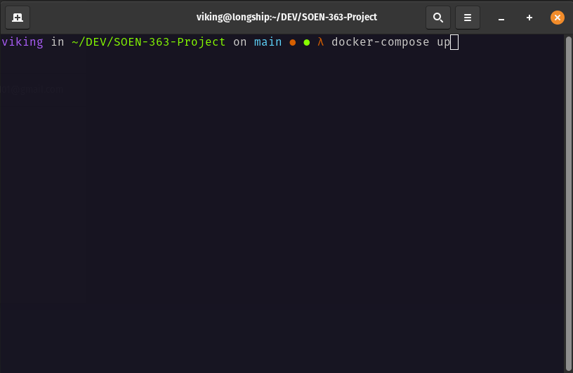
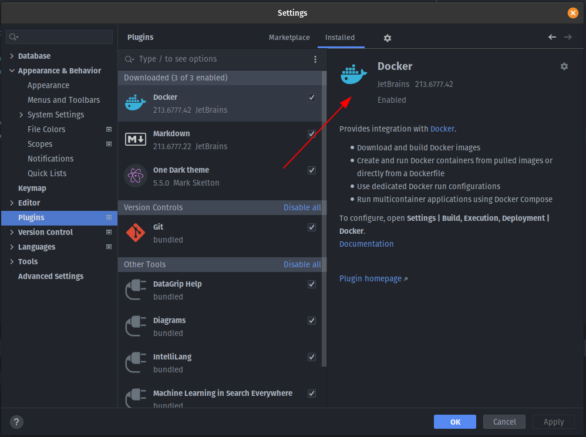
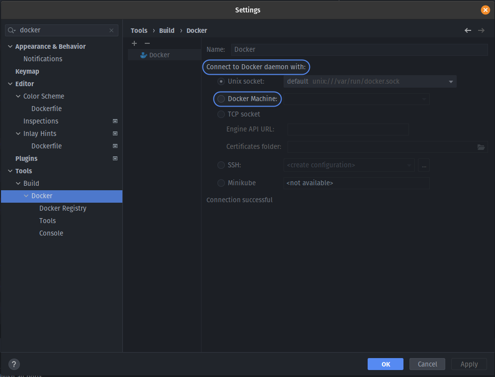
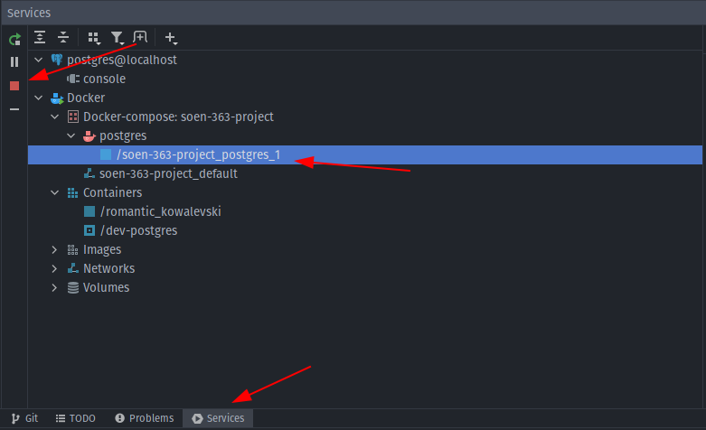
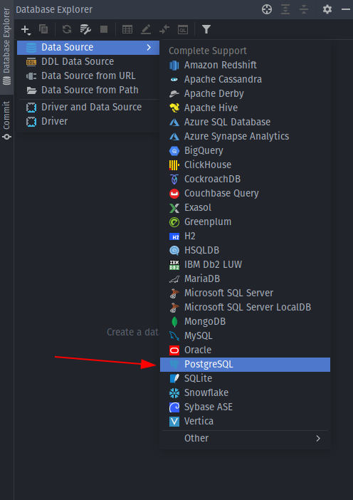
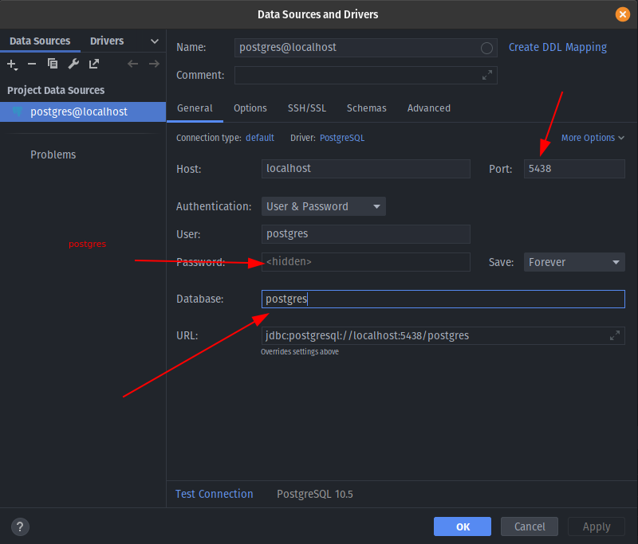

# SOEN-363-Project

## Project Setup
[Guide](https://levelup.gitconnected.com/creating-and-filling-a-postgres-db-with-docker-compose-e1607f6f882f)

### Installing Docker
[Docker Installation](https://docs.docker.com/get-docker/)

### Installing Docker Compose
[Docker Compose Installation](https://docs.docker.com/compose/install/)

### Running Postgres

### Connecting to Dockerized Instance of Postgres

- Make sure your docker service is running. You can see it on the service tab (if you install the plugin for docker)
- Installing the docker plugin:

- Connecting your docker program to the plugin
- Search Docker in your settings you should find a window that looks like the image below
- Your properties should be automatically set if you've installed docker + docker compose, just hit apply 
- Now your docker plugin works!

- You can stop/start the docker compose container once it's created under the services.

#### Adding Postgres Source using Datagrip

- Now that postgres is up, you can add it to datagrip.

