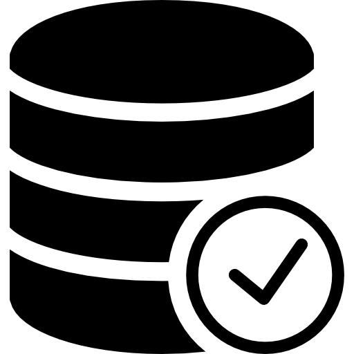

# SOEN-363-Project

  <a href="https://github.com/KrisTheCanadian/SOEN-363-Project">
  
    <h1 align="center">SOEN-363: Final Project</h1>
  </a>

  
  
  
      

# Project Information 🚀

[**Phase 1 Information (PDF)**](./PHASE_1/SOEN_363_Project_Phase1_winter.pdf)

[**Phase 2 Information (PDF)**](./PHASE_2/SOEN363_Project_Phase2-Winter2022.pdf)

[**Presentation Slides (Canva) 🖼**](https://www.canva.com/design/DAE9vDpNF9s/HErhMPvXCfrhe7tPx4mHNw/view?utm_content=DAE9vDpNF9s&utm_campaign=designshare&utm_medium=link2&utm_source=sharebutton)

## Datasets 📙

  
  

[**SQL Dataset 1 (Spotify)**](https://www.kaggle.com/datasets/pepepython/spotify-huge-database-daily-charts-over-3-years?select=Database+to+calculate+popularity.csv)

[**SQL Dataset 2 (Spotify)**](https://www.kaggle.com/datasets/pepepython/spotify-huge-database-daily-charts-over-3-years?select=Database+to+calculate+popularity.csv)

[**NoSQL Dataset (Reddit)**](https://files.pushshift.io/reddit/comments/)

## Importing the Data 📁

- Using Datagrip & Python scripts (cleaning and importing data)

> A really useful script for uploading to Elastic Search can be found [here](./PHASE_2/NoSQL/import_script.py)

## Team Members 💪 🎉 🔥

<table>
  <tr>
    <td align="center"><a href="https://github.com/KrisTheCanadian"> <b>Kristopher Beauchemin</b></a></td>
        <td align="center"><a href="https://github.com/Alexialsousa"> <b>Alexia Sousa</b></a></td> 
  </tr>
  <tr>
   <td align="center"><a href="https://github.com/mimi-ta"> <b>Mimi Ta</b></a></td>
   <td align="center"><a href="https://github.com/Sirlacksalot"> <b>Vincent Bruzzese</b></a></td>
  </tr>
</table>

 

## Queries 🖥️

### Phase 1 ✅

**SQL Queries**
Queries implementation: [here](./PHASE_1/sql/)

[**Phase 1 Queries (PDF)**](./PHASE_1/SOEN_363_Project_Phase1_winter.pdf)

### Phase 2 ✅

**SQL Queries**
Queries implementation: [here](./PHASE_2/sql/)

<ol>
  <li>What are all Led Zeppelin song names in rock_Music_data, and on which days do they end up on the popularDataSet in 2018]</li>
  <li>What are all the playlists that those Led Zeppelin songs feature in?</li>
  <li>What were the most popular songs (songs listed in the top 3) of the month of January of 2019 in Canada? Order by popularity and limit output to 10.</li>
  <li>What is the largest popularity gap in rock_Music (lowest popularity, highest popularity)?</li>
  <li>Which songs have the most genres (limit to 10 results)?</li>
  <li>Which band shows up the most often?</li>
  <li>Which bands show up in different genre tables?</li>
  <li>What are some good club music (danceability  > 0.8) listed as pop which artists also make music categorized as blues? Return the pop song and blues song with its respective artist.</li>
  <li>Out of the most popular alternative playlist, list in increasing order the songs above 5 minutes in length. </li>
  <li>How many pop songs released in 2020 that are in the top 20 have a tempo greater than 120?</li>
</ol>

**Elastic Search Queries**

Queries implementation: [here](./PHASE_2/NoSQL/queries.py)

<ol>
  <li>What are the top 10 most upvoted comments of all time? Print the comment and the score in an ordered list.</li>
  <li>How many of the comments listed as controversial are also listed as an edited comment?</li>
  <li>Show and state the number of all the controversial comments were made at night (after 10pm)?</li>
  <li>What is the percentage of comments with the word sorry in them and are also replying to another comment?</li>
  <li>Who were the top 3 users that commented the most in 2006? How many comments did they make and what was their top commented subreddit?</li>
  <li>Find all comments about postgres. Display the number of comments that have a score between 15-30. Display the top comment and the lowest comment in that range</li>
  <li>Display the number of comments for every subreddit and the top comment score. Order them in popularity.</li>
  <li>Query every comment between September 2007 and December 2007 that either has the word ‘sql’ or ‘nosql’ in the comment. Only include comments which have a score greater than 0. Print the number of comments and print the first 10 results (sorted by score).</li>
  <li>Find the top comment in January 2007, print it and also display the number of replies this comment got in total.</li>
  <li>Find all comments that mention at least 2 of the following words: sql, database and programming, software. In 2006. State the number of comments </li>
</ol>

## License 📝

This repository is available under the [MIT LICENSE](./LICENSE).
